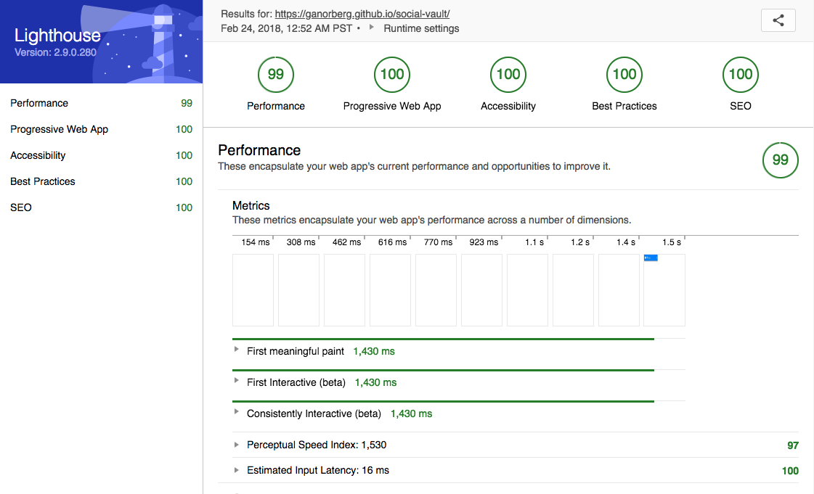

# Social Vault

https://socialvault.netlify.com/

Use this app to track relationships by storing people's names, their hobbies, any life aspirations, and so on. Bring up these details in future conversations to show that you care!

## Design document
Planning and pretty pictures: https://docs.google.com/document/d/1KPhkx54ixJjvgGrxv5iiGGpRitm2Qa2pwWfh_alV58g/edit?usp=sharing

## For the technically savvy
Responsive mobile-first single-page progressive web app with 99.8% Lighthouse score (see below). Works offline with add to homescreen functionality. Completely dynamic content generation, routing and history tracking with vanilla JavaScript, HTML, and CSS (no dependencies). Continuously deployed through Netlify.

## Lighthouse scoring

  

## Logo

  

